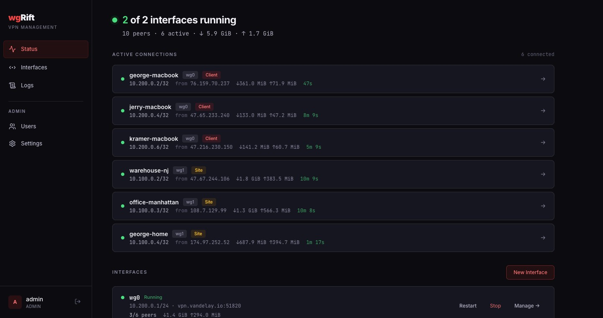
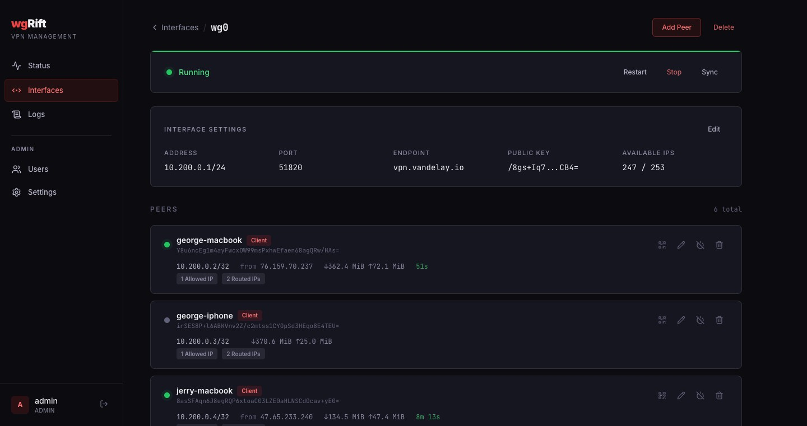
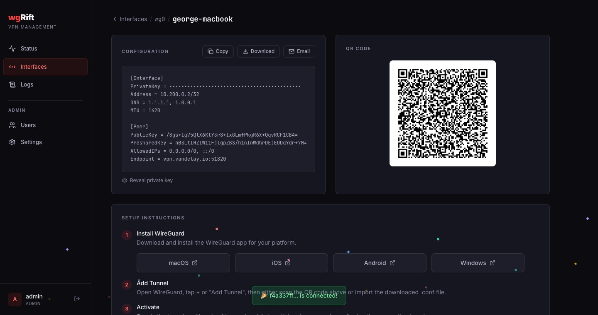
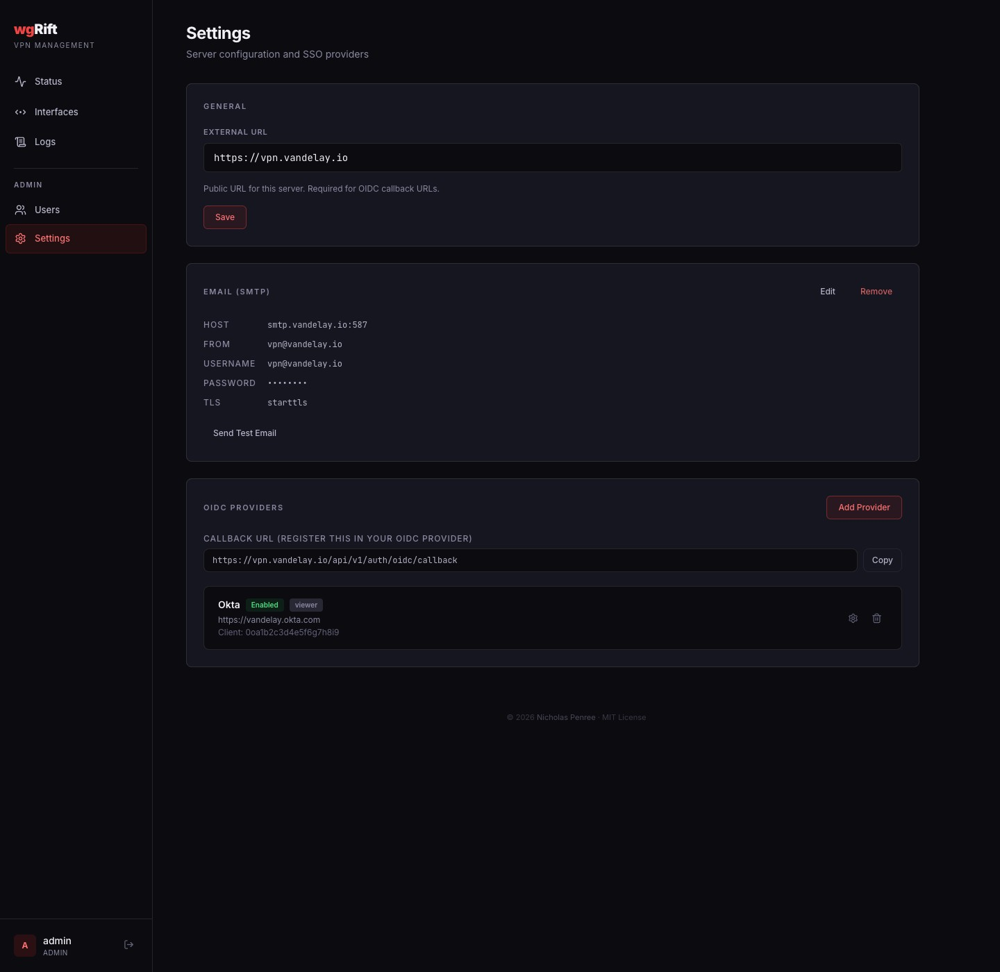
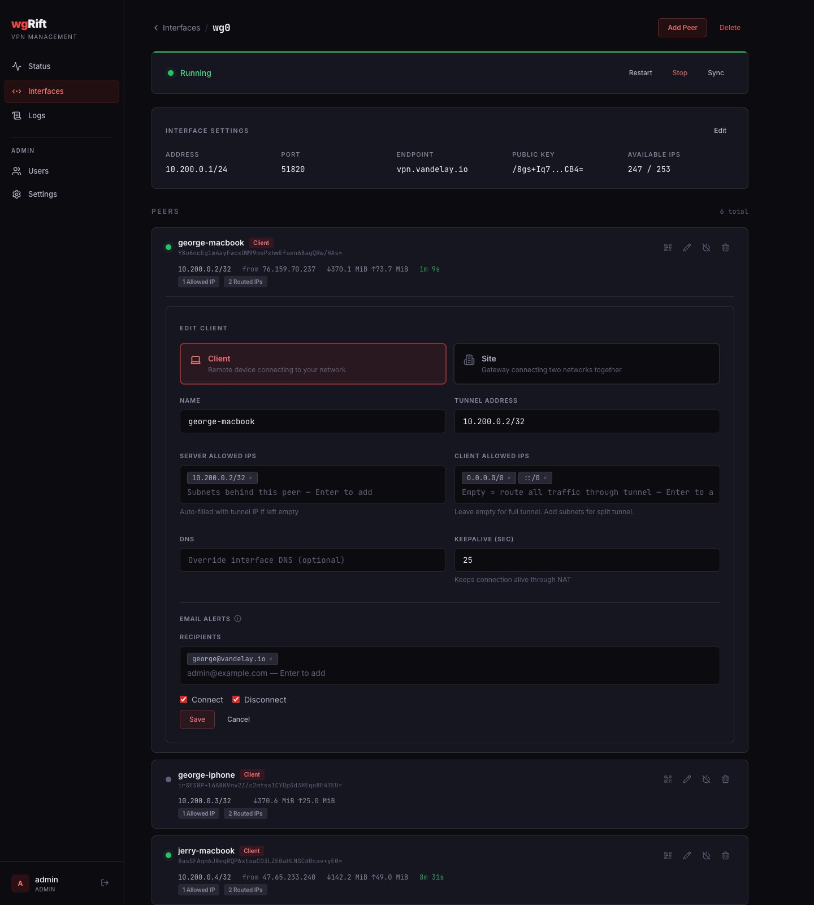
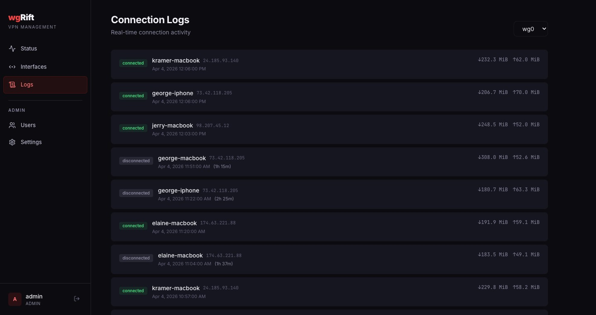
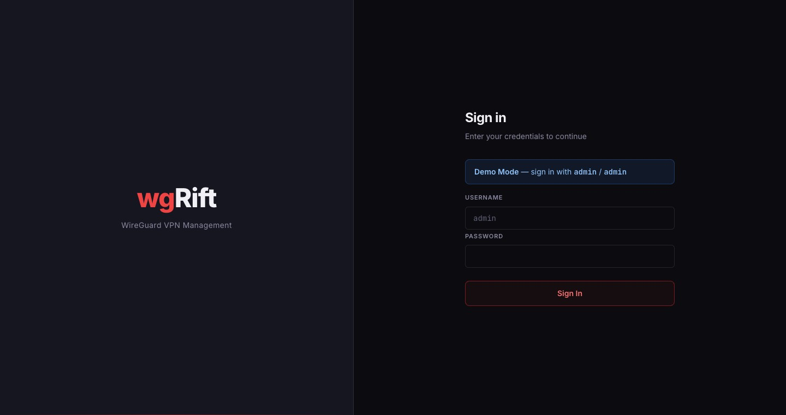
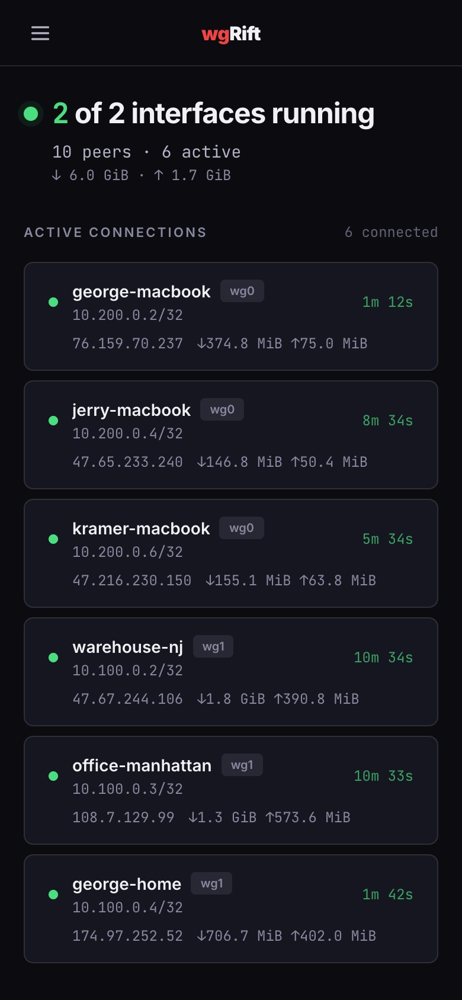

# wgRift

A self-hosted WireGuard VPN management platform. Single binary with embedded web UI, full CLI, and REST API.

## Screenshots

| Dashboard | Interface Detail |
|:---:|:---:|
|  |  |

| Peer Config & QR | Settings |
|:---:|:---:|
|  |  |

| Edit Peer & Email Alerts | Connection Logs |
|:---:|:---:|
|  |  |

| Login | Mobile |
|:---:|:---:|
|  |  |

## Features

### Web UI
- **Dashboard** — Overview of all interfaces with peer counts, transfer stats, and quick actions
- **Interface Management** — Create, import, or adopt existing WireGuard interfaces
- **Peer Management** — Add/edit/enable/disable peers with auto-generated keys and next available IP
- **Peer Config & QR** — View, copy, or download client configs; scan QR codes for mobile setup
- **Connection Logs** — Real-time connection/disconnection tracking per interface
- **Connection Uptime** — Live per-peer uptime counters on dashboard and interface views
- **Email Alerts** — Per-peer connect/disconnect email notifications with configurable recipients
- **SMTP Configuration** — Built-in SMTP settings management with test email support
- **SSO / OIDC** — OpenID Connect authentication with multi-provider support, JIT user provisioning, and role mapping
- **User Management** — Multi-user with admin/viewer roles
- **Mobile Responsive** — Slide-out nav, responsive layouts for all views
- **Session Auth** — Local login and OIDC with CSRF protection, idle timeout, and max session age

### CLI
- `wgrift interface create` — Create a new WireGuard interface
- `wgrift interface list` — List all managed interfaces
- `wgrift interface delete` — Remove an interface
- `wgrift interface sync` — Sync interface config to the kernel
- `wgrift peer add` — Add a peer to an interface
- `wgrift peer list` — List peers (optionally filtered by interface)
- `wgrift peer remove` — Remove a peer
- `wgrift peer enable/disable` — Toggle peer state
- `wgrift peer config` — Display client WireGuard config (with `--qr` for terminal QR code)
- `wgrift peer set-key` — Set a peer's private key
- `wgrift adopt <name>` — Import an existing running WireGuard interface
- `wgrift status` — Live status of all interfaces and peers
- `wgrift serve` — Start the web server
- `wgrift version` — Show version info

### API
Full REST API at `/api/v1/` — interface CRUD, peer CRUD, start/stop/restart, config generation, QR codes, connection logs, user management, and dashboard stats. See `internal/server/routes.go` for the complete endpoint list.

## Quick Start

### Build

Requires Go 1.26+, [Mage](https://magefile.org), and optionally [Air](https://github.com/air-verse/air) for live reload.

```bash
go install github.com/magefile/mage@latest          # Build tool
go install github.com/air-verse/air@latest           # Live reload (optional)
```

```bash
# Development
mage dev            # Live reload — watches files, rebuilds WASM+binary, restarts server
mage serve          # Build WASM + binary, start server (no live reload)

# Production build (linux/amd64)
mage dist           # Output: dist/wgrift (single binary with embedded UI)
```

### Install

```bash
# On the target host (Debian/Ubuntu):
bash deploy/install.sh

# Or manually:
cp dist/wgrift /usr/local/bin/wgrift
cp deploy/config.yaml /etc/wgrift/config.yaml
cp deploy/wgrift.service /etc/systemd/system/
systemctl enable --now wgrift
```

### Proxmox LXC

```bash
# Create a dedicated LXC container:
bash deploy/ct/wgrift.sh
```

### First Run

1. Navigate to `http://your-host:8080`
2. Create the initial admin account on the setup screen
3. Create or adopt a WireGuard interface
4. Add peers and distribute configs

## Configuration

Default config at `/etc/wgrift/config.yaml`:

```yaml
server:
  listen: "0.0.0.0:8080"
  external_url: ""              # Public IP/hostname for peer configs
  tls:
    mode: none                  # "none", "acme", or "manual"

database:
  path: /var/lib/wgrift/wgrift.db

encryption:
  master_key_file: /etc/wgrift/master.key

auth:
  session_timeout: 30m
  max_session_age: 24h
  local:
    enabled: true
    min_password_length: 16
  oidc:
    - name: "Authentik"
      issuer: "https://auth.example.com/application/o/wgrift/"
      client_id: "wgrift"
      client_secret_file: /etc/wgrift/oidc-secret
      scopes: ["openid", "profile", "email"]
      admin_claim: "groups"
      admin_value: "wgrift-admins"

logging:
  connection_poll_interval: 30s
  connection_timeout: 180s
  retention_days: 90
```

The master key encrypts peer private keys and OIDC client secrets at rest. It's generated automatically by the installer or can be set via the `WGRIFT_MASTER_KEY` environment variable.

OIDC providers can also be configured through the web UI under **Settings → OIDC Providers**. Users are provisioned automatically on first login, and the `admin_claim`/`admin_value` fields control which claim value grants the admin role.

## Architecture

```
cmd/wgrift/          Cobra CLI — all commands
internal/
  auth/              Session auth, bcrypt, CSRF, OIDC
  config/            YAML config with env var overrides
  confgen/           WireGuard .conf generation & parsing
  models/            Interface, Peer, User, Session, ConnectionLog
  server/            HTTP handlers, middleware, SPA serving
  store/             SQLite database with auto-migrations
  wg/                WireGuard kernel control (wgctrl + netlink)
ui/
  embed.go           go:embed — single binary includes all web assets
  web/               WASM web UI (Loom reactive framework)
deploy/              systemd service, config, installer, Proxmox script
```

The web UI compiles from Go to WebAssembly using the [Loom](https://github.com/loom-go/loom) reactive framework. All assets (HTML, WASM, JS) are embedded in the binary via `go:embed` — no external file serving required.

## Requirements

- Linux with WireGuard kernel module
- `wg` and `wg-quick` (from `wireguard-tools`)
- `CAP_NET_ADMIN` and `CAP_NET_RAW` capabilities (granted via systemd)

## License

MIT
